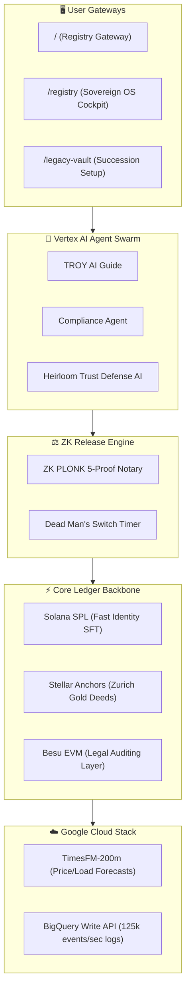

# Unykorn - Sovereign Web3 Infrastructure & Deterministic Systems

**A sovereign, cryptographically-verified namespace registry, digital legacy estate operating system, and macroeconomic simulation suite founded by Kevan Burns.**

[](https://www.typescript.org/)
[](https://nextjs.org/)
[](https://www.rust-lang.org/)
[](https://solana.com/)
[](https://stellar.org/)

> *Founded by Kevan Burns • Moltbook Genesis Protocol • Live on Solana & Stellar • Deterministic Systems*

---

## 🦄 Core Brand Positioning & Thesis

Unykorn is a sovereign Web3 infrastructure platform delivering permanent digital identity, secure estate succession, and deterministic macroeconomic systems. By decoupling high-speed client interactions from compliance-heavy settlement reserves, Unykorn operates a dual-chain architecture:

1. **Solana (Token-2022)**: Handles high-frequency, non-transferable SFT identity namespaces, local agent keys, and instant developer API authentications.
2. **Stellar (Asset Anchors)**: Anchors legally-bound real-world asset deeds, commodity reserves (such as Zurich vault gold physical receipts), and KYC-compliant financial gates.

---

## 🛠️ The Unykorn Ecosystem Products

### 1. Sovereign Web3 Namespaces
Programmable root namespace suffixes (e.g. `.1`, `.gold`, `.rwa`, `.mcp`, `.estate`) acting as permanent identities. Users can register sub-namespaces (such as `smith.legacy` or `novapay.store`) to link credentials, payments, and document hashes under a unified ZK-verified identity.

### 2. Moltbook Genesis Protocol
A deterministic macroeconomic simulation engine consisting of **13 modular Rust crates** and **396 automated tests**. Before on-chain deployment, Moltbook simulates over **6,820 independent worlds** to verify carrying capacity limits, asset valuation models, and dynamic metered rates (via x402 membranes) with a **0.00% simulation divergence rate**.

### 3. Legacy Vault Protocol (LVP)
A private, client-side encrypted estate operating system. Incorporates **AES-256-GCM encryption** and **ZK PLONK proofs** to coordinate multi-sig heir quorums, Dead Man's Switch triggers, and automated estate distributions without intermediary third parties.

---

## 📊 Global Suffix Valuation & Positioning Matrix

| Suffix Class / Suffixes | Mid-Case Net FMV | Comparable Platforms | Ecosystem Share Potential (3-Year Flow) |
| --- |:---:| --- |:---:|
| **Class A (Store of Value)** <br> `.1`, `.gold`, `.gas`, `.oil`, `.money`, `.prime` | **$11.8M** | PayPal, Wise, Circle, Gold ETF | **0.10%** ($1.4B transaction volume) |
| **Class B (Institutional)** <br> `.bank`, `.trust`, `.fund`, `.pay`, `.yield`, `.treasury` | **$16.2M** | DocuSign, Cartata, Trust & Wills | **0.05%** ($2.1B capital routing) |
| **Class C (Utility & Energy)** <br> `.energy`, `.power`, `.grid`, `.solar`, `.mining`, `.carbon`, `.credit` | **$14.5M** | BP, EV/Hash, ESG Registries | **0.08%** ($1.8B resource tracking) |
| **Class D (Tech & AI)** <br> `.mcp`, `.ai`, `.agent`, `.node`, `.cloud`, `.quant`, `.proof`, `.sign`, `.ipfs` | **$15.8M** | OpenAI, Cloudflare Workers, IPFS | **0.12%** ($3.0B compute loops) |
| **Class E (Space & Land)** <br> `.rwa`, `.estate`, `.vault`, `.legacy`, `.chain`, `.x`, `.med`, `.meta`, `.land` | **$12.4M** | Propy, RealT, Zillow, Everplans | **0.07%** ($1.2B fractional deeds) |

---

## 🏗️ Technical Architecture & Google Cloud Integration



* **TimesFM-200m**: Predicts network traffic limits and Zurich gold prices over a rolling 24-step horizon. Automatically scales lease renewal rates via x402 membranes.
* **BigQuery Write API**: Streams all registry edits, owner changes, and settlements directly for real-time audit trails.
* **Vertex AI Swarm Nodes**: Hosts 22 cognitive agent twins (like TROY) to automate KYC, parse trust deeds, and manage partner interactions.

---

## 📁 Repository Structure

```
legacy-vault-protocol/
├── app/
│   ├── moltbook-genesis/ # Moltbook Rust crates index & interactive simulator
│   ├── connect/          # AI-friendly gateway, SSRN papers, endpoint indexes
│   ├── registry/         # Unykorn Sovereign OS Cockpit dashboard
│   ├── registry-gateway/ # Default registry gateway landing page
│   ├── about/            # Story of Kevan Burns and Unykorn history
│   ├── developers/       # OpenAPI specifications & health checks
│   └── blog/             # 10 High-impact Web3 blog posts
├── lib/
│   ├── crypto/           # Zero-Knowledge key generation & AES-256-GCM
│   ├── ipfs/             # Cloudflare IPFS Web3 gateways
│   ├── blockchain/       # Solana SPL & Stellar CNAME adapters
│   └── agents/           # Gemini client & cognitive twin routing
├── contracts/            # Solidity smart contracts for Besu EVM
└── solana-anchor/        # Solana Rust program files
```

---

## 🚀 Getting Started

### 1. Prerequisites
```bash
Node.js 22+
pnpm 11+
WSL (Windows Subsystem for Linux)
```

### 2. Quick Start
```bash
# Clone the repository
git clone https://github.com/FTHTrading/Kevan-Burns.git
cd Kevan-Burns

# Install dependencies
pnpm install

# Setup environment variables
cp .env.example .env
# Configure GEMINI_API_KEY, CLOUDFLARE_API_TOKEN, SOLANA_RPC, and STELLAR_SECRET

# Run local development server
pnpm dev
```

### 3. Verification & Local Tests
```bash
pnpm typecheck  # Run TypeScript compilations check
pnpm test       # Run unit test harness
```

---

## 📜 Kevan Burns - Key Published Works
* **“Deterministic Literary Publishing: A Multi-Layer Provenance Model for Verifiable Manuscripts”** — Kevan Burns, February 2026.
  * [SSRN Abstract #6241279](https://papers.ssrn.com/sol3/papers.cfm?abstract_id=6241279)
  * [ResearchGate Publication](https://www.researchgate.net/publication/403558328_Deterministic_Literary_Publishing_A_Multi-Layer_Provenance_Model_for_Verifiable_Manuscripts)
* Headquartered in Norcross Technology Park, 5655 Peachtree Parkway, Suite 100, Norcross, GA 30092. Serving Atlanta Metro families for digital estate succession to bypass probate courts.
* Support contact email: `kevan@unykorn.ai`.

---

## 📄 License
All rights reserved. Proprietary software of Unykorn Platforms.