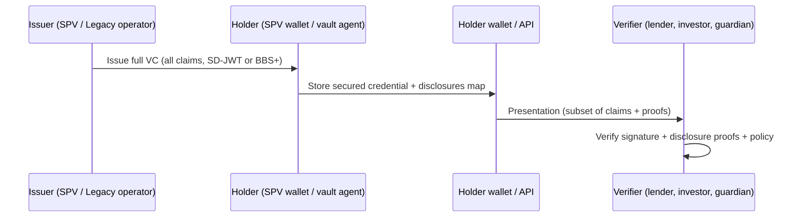

# VCDM 2.0 Selective Disclosure — Legacy Vault & Gem RWA

**Audience:** Engineering, compliance, and operator teams wiring Allure Ruby + Siam Emerald into Legacy Vault Protocol, troptionsmint Token-2022 metadata, and the multi-proof release engine. Package NAV is **not asserted** in this repository — valuation remains TBD pending independent appraisal.

**Related:** [did-vc-integration.md](./did-vc-integration.md) · [ruby-rwa/VC_SCHEMA_ASSET_PROVENANCE.md](./ruby-rwa/VC_SCHEMA_ASSET_PROVENANCE.md) · [ruby-rwa/API_SD_JWT.md](./ruby-rwa/API_SD_JWT.md)

---

## 1. Selective disclosure in one page

Under [W3C Verifiable Credentials Data Model 2.0](https://www.w3.org/TR/vc-data-model-2.0/) (VCDM 2.0), a credential lifecycle has four roles:



| Role | Legacy + RWA mapping |
|------|----------------------|
| **Issuer** | SPV or FTH operator DID; signs `AssetProvenanceCredential` after manifest + cert pipeline |
| **Holder** | SPV custody agent or Legacy vault namespace holding the full SD-JWT |
| **Presentation** | Holder-generated proof for a specific verifier audience (lender portal, Reg D data room) |
| **Verifier** | Counterparty that checks only the claims it is entitled to see |

**Principle:** The issuer attests to the *full* truth once; the holder reveals *minimum necessary* claims per transaction. Full appraisals, Gübelin report CIDs, and guardian PII stay in the **encrypted Legacy vault**; verifiers receive hashes, tiers, and booleans where sufficient.

---

## 2. Format comparison: SD-JWT vs BBS+ vs CSD-JWT

| Dimension | **SD-JWT** (IETF) | **BBS+** (Data Integrity) | **CSD-JWT** (emerging) |
|-----------|-------------------|-----------------------------|-------------------------|
| **Standard maturity** | RFC track; OID4VP profiles shipping | W3C DI + MATTR/IBM interop | Early drafts; JWT + SD hybrid |
| **Presentation shape** | JWT + `~` disclosed claim digests | JSON-LD VC + derived proof | JWT-like; constraint semantics TBD |
| **Selective disclosure** | Per-claim hashes in `_sd` array | Zero-knowledge style selective reveal | Intended claim-level constraints |
| **Unlinkability** | Weak by default (same `sub`, correlatable sessions) | **Strong** — different presentations hard to link | TBD; goal is constrained + less linkable than flat JWT |
| **Wallet / OID4VP** | Excellent (EUDI, OpenID4VCI) | Growing (enterprise, Web3) | Not production-ready |
| **Solana / Token-2022 metadata** | Fits compact URI + hash pointers | Larger proofs; off-chain anchor typical | Future option |
| **Implementation cost** | Low (`@sd-jwt/*`) | Medium–high (BBS libraries, DID key types) | High (spec churn) |
| **Secondary market** | Adequate for primary placement | **Preferred** when buyers must not correlate seller history | Watchlist |

### Recommendation (FTH stack)

| Horizon | Choice | Rationale |
|---------|--------|-----------|
| **Short-term (0–6 mo)** | **SD-JWT** | Fastest path to lender-minimal and investor-placement profiles; aligns with existing JWT/hash audit patterns in Legacy |
| **Medium-term (secondary market)** | **BBS+** | Unlinkable presentations reduce fingerprinting across buyers and protect SPV negotiation position |
| **Long-term** | Monitor **CSD-JWT** | Adopt when constraint expressions (e.g. “valuation band without exact figure”) stabilize |

### Unlinkable disclosure note

- **SD-JWT:** Verifiers who see multiple presentations from the same holder can often correlate via `sub`, `iss`, timing, and stable disclosed fields. Mitigate with audience-bound nonces, short TTL, and separate holder sub-DIDs per counterparty where policy allows.
- **BBS+:** Designed so two presentations over the same credential are not trivially linkable without the issuer’s secret key material — valuable when the same gem bundle is shown to competing lenders or sequential investors.
- **Operational:** Regardless of format, **never** embed raw Gübelin PDFs, owner PII, or full appraisal numbers in on-chain Token-2022 metadata; use tier summaries and vault manifest CIDs only.

---

## 3. Gem RWA (Allure Ruby + emerald) — disclosure examples

Synthetic scenarios only; no production CIDs or valuations.

### Lender (credit / lien position)

**Disclosure group:** `lender-minimal`

Verifier receives:

- `clearTitle: true`
- `lienStatus: "none"`
- `certTierSummary: "premium"` (Gübelin + secondary lab tier rollup — not full `certIssuerCids[]`)
- `valuationAboveThreshold: true` or `ref:appraisal-band-7` (boolean/threshold ref — not $ figures)

Lender does **not** receive: carat breakdown per stone, treatment narrative, SPV cap table, or guardian identities.

### Investor (Reg D placement)

**Disclosure group:** `investor-placement`

- `origin`, `treatmentDisclosure` (summary), `certIssuerCount`, `spvDid`, `assetType: "bundle"`

Full lab CIDs and GMII oracle refs remain vault-encrypted until `full-diligence` under NDA.

### Guardian (release / policy)

**Disclosure group:** `guardian-auth`

- `guardianRole: "quorum-member"`
- `authorizationLevel: "approve"`

No quorum member names, emails, or wallet addresses in the presentation — those remain in Legacy `Guardian` records and audit log actor IDs (hashed/off-chain).

### Full diligence (accredited + NDA)

**Disclosure group:** `full-diligence` — all claims in [VC_SCHEMA_ASSET_PROVENANCE.md](./ruby-rwa/VC_SCHEMA_ASSET_PROVENANCE.md), still **without** replacing encrypted vault blobs; CIDs are pointers, not decrypted content.

---

## 4. Integration map

```
┌─────────────────────────────────────────────────────────────────┐
│ Legacy Vault (encrypted docs, manifest SHA-256, audit log)      │
│  • Gübelin / SSEF / lab PDFs → IPFS CIDs (ciphertext)           │
│  • Manifest CID ───────────────────────────────┐                │
└────────────────────────────────────────────────│────────────────┘
                                                 │
┌────────────────────────────────────────────────▼────────────────┐
│ Issuer API: POST /api/vc/issue/asset-provenance                 │
│  • AssetProvenanceCredential (full claims) → SD-JWT (holder)    │
└────────────────────────────────────────────────┬────────────────┘
                                                 │
         ┌───────────────────────────────────────┼───────────────────┐
         ▼                                       ▼                   ▼
┌─────────────────┐              ┌──────────────────────┐   ┌─────────────────┐
│ troptionsmint   │              │ POST present/selective│   │ Release engine  │
│ Token-2022      │              │ lender-minimal / etc. │   │ (future cond.)  │
│ metadata URI    │              └──────────┬───────────┘   │ vcPresentation  │
│ vcCredHash      │                         │               │ Verified + tier │
│ manifestCid     │                         ▼               └─────────────────┘
└─────────────────┘              ┌──────────────────────┐
                                 │ GET verify/presentation│
                                 │ Lender / investor UI   │
                                 └──────────────────────┘
```

| Layer | Selective disclosure touchpoint |
|-------|--------------------------------|
| **Legacy Vault** | Source of truth for encrypted certs, appraisals, SKR; manifest hash in VC |
| **VerificationCredential (DB)** | Store `credentialHash` + type; not the full JWT in production |
| **troptionsmint Token-2022** | On-chain: `legacyVaultManifestCid`, `vcCredentialHash`, disclosure profile id |
| **Release engine** | Planned condition: `vcPresentationVerified` + `disclosureGroup` + optional `clearTitle` / quorum (see issue: wire presentations) |
| **Audit log** | `VAULT_UPDATED` / `ACCESS_GRANTED` with `subtype` VC_* and `chainEventHash` anchor |

---

## 5. Security & compliance

| Topic | Guidance |
|-------|----------|
| **Reg D / Reg S** | Use `investor-placement` or `lender-minimal` by default; `full-diligence` only with accredited investor workflow + NDA artifact in vault |
| **Minimal disclosure** | Match SEC/FINRA marketing constraints — presentations are claims, not prospectuses |
| **Audit trail** | Every issue/present/verify calls `logEvent` (see API doc); full evidence chain remains in Legacy encrypted vault + append-only `AuditEvent` |
| **PII** | No owner/guardian PII in VC claims; use DIDs and roles |
| **Revocation** | Plan `revokedAt` on `VerificationCredential` + status list URI before mainnet RWA |

---

## 6. Implementation checklist

- [x] Schema + disclosure groups — `lib/rwa/vc-schema.ts`, [VC_SCHEMA_ASSET_PROVENANCE.md](./ruby-rwa/VC_SCHEMA_ASSET_PROVENANCE.md)
- [x] API stubs — `app/api/vc/*`, [API_SD_JWT.md](./ruby-rwa/API_SD_JWT.md)
- [ ] `@sd-jwt/*` integration — issue, present, verify (GitHub issue)
- [ ] BBS+ evaluation for secondary market (GitHub issue)
- [ ] Release engine `ReleaseCondition` types for VC presentations (GitHub issue)
- [ ] Persist credentials in `VerificationCredential` + holder wallet export

---

## 7. References

- [W3C VC Data Model 2.0](https://www.w3.org/TR/vc-data-model-2.0/)
- [IETF SD-JWT](https://datatracker.ietf.org/doc/draft-ietf-oauth-selective-disclosure-jwt/)
- [LEGACY_VAULT_ARCHITECTURE.md](./LEGACY_VAULT_ARCHITECTURE.md)
- [LEGAL_AND_SECURITY_GUARDRAILS.md](./LEGAL_AND_SECURITY_GUARDRAILS.md)
