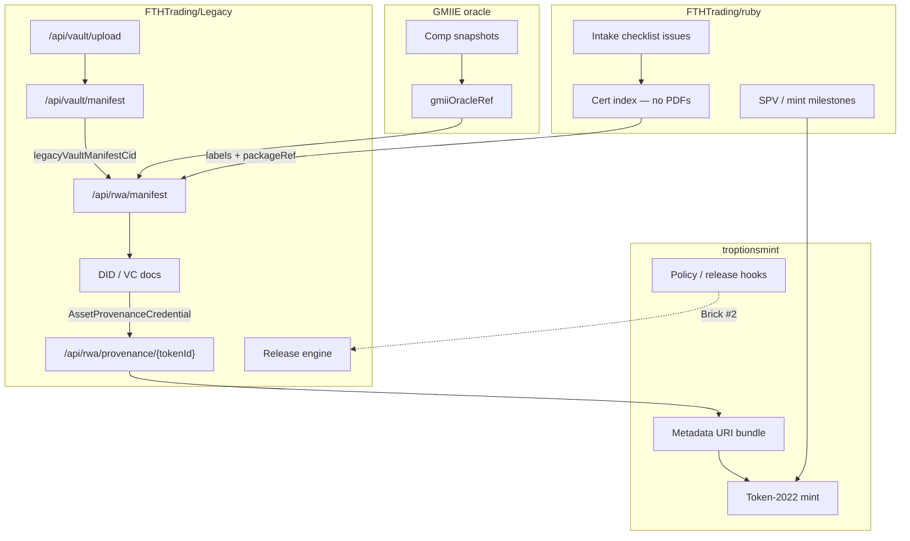

# Integration Map — Legacy ↔ ruby ↔ troptionsmint ↔ GMIIE

---

## Repository responsibilities

| System | Owns | Does not own |
|--------|------|----------------|
| **ruby** | Planning, intake gates, public indexes | Encrypted PDFs, private keys |
| **Legacy** | Encryption, IPFS CIDs, manifests, VC/DID, audit | Mint authority (troptionsmint) |
| **troptionsmint** | SPL Token-2022 mint, on-chain metadata | Vault encryption keys |
| **GMIIE** | Market comp references | Legal appraisal / NAV |

---

## API touchpoints

| Direction | Call |
|-----------|------|
| ruby → Legacy | `POST /api/rwa/manifest` with `packageRef` |
| Legacy → ruby | Issue comment with `manifestId`, `contentHash` (no CIDs in public issue if policy requires) |
| troptionsmint → Legacy | `GET /api/rwa/provenance/{tokenId}` before/after mint |
| Legacy → troptionsmint | Publish metadata JSON URIs from [TOKEN_METADATA.md](./TOKEN_METADATA.md) |
| GMIIE → Legacy | Optional `gmiiOracleRef` on manifest + VC |

---

## Data objects

| Object | Location | Anchors |
|--------|----------|---------|
| Encrypted cert PDF | Legacy private IPFS | `documentSummaries[].cid` in vault manifest |
| RWA intake manifest | Legacy (stub → persisted) | `contentHash`, future `legacyVaultManifestCid` |
| AssetProvenanceCredential | IPFS / HTTPS proof URI | `certCids`, `spvDid`, `lienStatus` |
| Token-2022 metadata | troptionsmint | `manifestUri`, `vcProofUri`, `spv.did` |

---

## Brick roadmap

| Brick | Deliverable |
|-------|-------------|
| **#1 (this)** | Docs, API stubs, GitHub milestone |
| **#2** | VC issuance endpoint + release-engine RWA flags |
| **#3** | Live manifest IPFS publish + troptionsmint metadata bind |
| **#4** | GMIIE live oracle + appraisalRef when cleared |

See [README.md](./README.md).
