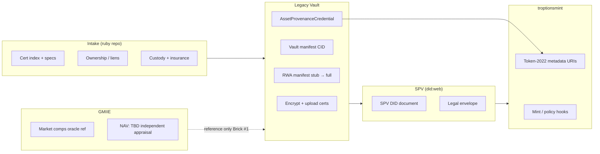

# Ruby RWA — Legacy Vault Integration (Brick #1)

**Track:** FTHTrading Allure Ruby + Siam Emerald RWA (valuation **TBD — independent appraisal required**; package NAV not asserted in repo; optional copper SKR).

**Planning repo:** [FTHTrading/ruby](https://github.com/FTHTrading/ruby) — intake checklists, cert indexes, SPV milestones (no unredacted certs in git).

**Provenance host:** [FTHTrading/Legacy](https://github.com/FTHTrading/Legacy) (this repo) — encrypted storage, manifests, DID/VC, API stubs.

---

## How Legacy Vault backs the ruby repo

| Concern | Legacy Vault | FTHTrading/ruby |
|--------|--------------|-----------------|
| Encrypted cert PDFs / lab reports | `POST /api/vault/upload` → private IPFS CIDs | Index only: labels, lab names, dates (no PDF bytes) |
| Tamper-evident package summary | `POST /api/vault/manifest` → encrypted manifest CID | `manifestCid` reference in tracking issues |
| RWA intake manifest (Brick #1) | `POST /api/rwa/manifest` (stub → full pipeline) | `packageRef` + cert label list |
| Identity / guardians | W3C DID + VC 2.0 ([did-vc-integration.md](../did-vc-integration.md)) | SPV / custodian DID placeholders |
| On-chain metadata | URIs consumed by troptionsmint | Token mint checklist (no NAV in metadata) |

Legacy never stores plaintext gem certificates on the application server. Owners (or operators) encrypt at the edge, upload to private IPFS, then register CIDs and SHA-256 hashes — same model as estate documents.

---

## End-to-end flow: intake → SPV → mint

1. **Intake** — Complete [INTAKE_CHECKLIST.md](./INTAKE_CHECKLIST.md); track progress in FTHTrading/ruby issues.
2. **Legacy Vault** — Create or attach a vault; upload encrypted Gübelin / SSEF / GIA / AGL reports and custody docs; regenerate vault manifest.
3. **RWA manifest** — Call `POST /api/rwa/manifest` with `packageRef`, `assetClass`, and cert labels; later bind `legacyVaultManifestCid` from the vault.
4. **SPV** — Assign `did:web` for the SPV; issue `AssetProvenanceCredential` (see DID doc).
5. **troptionsmint** — Publish Token-2022 metadata per [TOKEN_METADATA.md](./TOKEN_METADATA.md); no NAV field until independent appraisal.
6. **GMIIE** — Attach `gmiiOracleRef` for market narrative; oracle does not replace appraisal.

---

## troptionsmint Token-2022 metadata

Metadata URIs point to **public** JSON (manifest summary, SPV DID doc, VC proof bundle) — not to encrypted vault blobs. Encrypted CIDs remain in the VC `certCids` claim and vault manifest summaries.

See [TOKEN_METADATA.md](./TOKEN_METADATA.md) and [INTEGRATION_MAP.md](./INTEGRATION_MAP.md).

---

## GMIIE oracles

GMIIE (Global Market Intelligence for Import/Export — internal oracle naming) supplies **reference comps** for narrative and dashboards, not legal appraisal or offering NAV. Brick #1 uses `gmiiOracleRef` as an optional URI in manifest and VC claims.

Valuation language must read: **TBD pending independent appraisal**.

---

## API (Brick #1)

| Method | Path | Purpose |
|--------|------|---------|
| `POST` | `/api/rwa/manifest` | Validate intake body; return placeholder manifest |
| `GET` | `/api/rwa/provenance/[tokenId]` | Proof package shape for metadata + VC |

Requires `x-user-id` header on POST (matches vault routes).

---

## Related docs

- [INTAKE_CHECKLIST.md](./INTAKE_CHECKLIST.md)
- [TOKEN_METADATA.md](./TOKEN_METADATA.md)
- [SIAM_EMERALD_MARKET.md](./SIAM_EMERALD_MARKET.md)
- [INTEGRATION_MAP.md](./INTEGRATION_MAP.md)
- [../did-vc-integration.md](../did-vc-integration.md)

---

## Legal / ops

- Proprietary — © FTH Trading. Do not commit unredacted certificates or appraisal PDFs to any public repo.
- This documentation is engineering alignment, not an offer or securities opinion.
