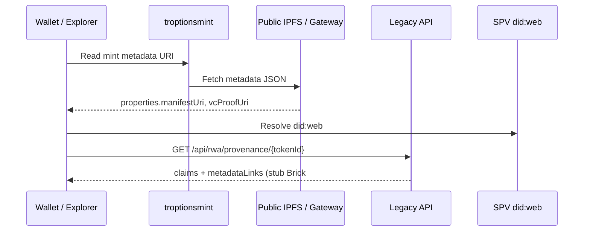

# Token-2022 Metadata Pattern (troptionsmint)

Brick #1 defines URI structure and claims linkage only. **No NAV** until an independent appraisal is issued and legally cleared for disclosure.

---

## Design principles

1. **Public metadata JSON** contains URIs and disclosure flags — not encrypted certificate bytes.
2. **Manifest CID** points to a redacted, publishable package summary (hashes, labels, SPV DID).
3. **SPV DID** resolves via `did:web` HTTPS document.
4. **VC proof URI** points to a verifiable presentation or embedded proof bundle (IPFS or HTTPS).
5. **GMIIE** referenced as oracle URI for comps — not appraisal.

---

## Suggested Token-2022 metadata fields

| Field | Example | Content |
|-------|---------|---------|
| `name` | `Allure Ruby RWA — Lot A` | Display only |
| `symbol` | `AURA-RWA` | Project convention |
| `description` | Short narrative | No dollar NAV |
| `image` | `ipfs://<marketing-image-cid>` | Non-sensitive render |
| `external_url` | `https://github.com/FTHTrading/ruby` | Planning repo |
| `attributes` | trait array | Carat band, origin region, treatment flag |
| `properties` | extension object | See below |

### `properties` extension (Legacy + troptionsmint)

```json
{
  "legacyVault": {
    "manifestUri": "ipfs://bafy...manifest-summary",
    "manifestHash": "<sha256-hex>",
    "packageRef": "fth-allure-ruby-2026"
  },
  "spv": {
    "did": "did:web:spv.example.com",
    "didDocumentUri": "https://spv.example.com/.well-known/did.json"
  },
  "credentials": {
    "assetProvenanceVcUri": "ipfs://bafy...vc-proof",
    "credentialType": "AssetProvenanceCredential"
  },
  "oracle": {
    "gmiiOracleRef": "https://gmii.example/oracle/v1/comps/siam-emerald",
    "navPolicy": "TBD pending independent appraisal"
  },
  "release": {
    "legacyReleasePolicyAware": true,
    "brick": 1
  }
}
```

Replace placeholder CIDs after intake and VC issuance.

---

## URI resolution flow



---

## Linkage to verifiable credentials

`AssetProvenanceCredential` claims (see [did-vc-integration.md](../did-vc-integration.md)) must align with metadata URIs:

| VC claim | Metadata field |
|----------|----------------|
| `legacyVaultManifestCid` | `properties.legacyVault.manifestUri` |
| `spvDid` | `properties.spv.did` |
| `certCids[]` | Not duplicated in public metadata — verify via VC |
| `gmiiOracleRef` | `properties.oracle.gmiiOracleRef` |
| `appraisalRef` | null until appraisal; then HTTPS/IPFS ref |

---

## Release engine (future brick)

RWA mint must not imply automatic release of encrypted vault documents. troptionsmint policy hooks should require:

- VC `credentialStatus === ISSUED`
- `lienStatus === CLEAR` (or policy-defined)
- Optional guardian / SPV co-signatures

Brick #2: implement RWA-specific conditions in `lib/release/release-engine.ts`.

---

## Prohibited in Brick #1 metadata

- Unredacted lab report PDFs or serial numbers
- Appraisal dollar amounts presented as fact
- Private keys, seed phrases, or custodian access codes
